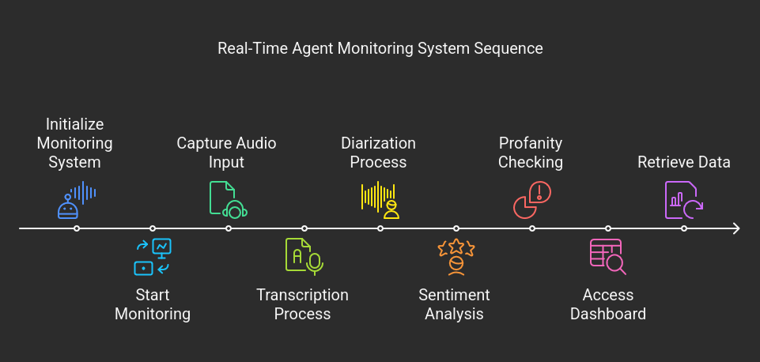

# Real-Time Agent Monitoring System
A comprehensive solution for monitoring customer service and BPO agent interactions in real-time, with advanced voice analytics capabilities.



## Features
- **Real-time transcription**: Fast and accurate conversion of speech to text with timestamping
- **Speaker diarization**: Identification and labeling of different speakers in conversations
- **Sentiment analysis**: Detection of emotional states and conversation context
- **Profanity detection**: Automatic flagging of inappropriate language
- **Pause detection**: Analysis of conversation flow and response times
- **Tonality checking**: Evaluation of voice tone and speech patterns
- **Knowledge accuracy**: Assessment of information correctness (future development)

## Tech Stack
- **Languages**: 
  - Python (Backend processing)
  - TypeScript (Frontend)
- **Frameworks**:
  - Django Channels (Backend)
  - Next.js with shadcn components (Frontend)
- **Transcription**: VOSK small model + Kaldi recognizer
- **Sentiment Analysis**: SIA (NLTK's Sentiment Intensity Analyzer)
- **Profanity Detection**: Better Profanity library
- **Real-time Connection**: WebSockets
- **Database**: SQLite (development), PostgreSQL (production planned)


## Technical Implementation
### Transcription
- **Key Aspects**: Speed (real-time), accuracy, timestamping
- **Approach**: 
  - Audio input capture via PyAudio
  - Audio segmentation into chunks and frames
  - Real-time parsing and transcription using VOSK + Kaldi recognizer
  - Serialized output delivery

### Diarization
- **Key Aspects**: Multi-speaker detection, accurate labeling, agent identification
- **Approach**:
  - Processing serialized sentence data
  - Pause-based speaker change detection
  - Converting sentences to embeddings for voice pattern comparison
  - Agent identification using dictionary of common agent keywords/phrases

### Sentiment Analysis
- **Key Aspects**: Emotional context understanding, negative emotion detection
- **Approach**:
  - Voice-to-text conversion
  - Sentiment determination using VADER Lexicon

### Profanity Checking
- **Key Aspects**: Inappropriate language detection, alert system
- **Approach**:
  - Dictionary-based detection using Better Profanity library


## Dashboard Access
The monitoring interface is accessible to both:
- Individual agents for self-improvement and real-time feedback
- Supervisors for team management and quality assurance

## Installation
```bash
# Clone the repository
git clone https://github.com/yourusername/agent-monitoring-system.git
cd agent-monitoring-system
# Create and activate virtual environment
python -m venv venv
source venv/bin/activate  # On Windows: venv\Scripts\activate
# Install dependencies
pip install -r requirements.txt
```

## Usage
```python
from agent_monitor import AgentMonitor
# Initialize the monitoring system
monitor = AgentMonitor(source="microphone")  # or source="file", path="call_recording.wav"
# Start monitoring
monitor.start()
# Access results
transcription = monitor.get_transcription()
sentiment_scores = monitor.get_sentiment()
speakers = monitor.get_speakers()
profanity_instances = monitor.get_profanity_alerts()
```


## Requirements
- Python 3.8+
- PyAudio
- VOSK
- Better Profanity
- NLTK (for VADER)
- NumPy
- PyTorch (for embeddings)
- Node.js 16+
- npm or yarn

## Status
This project is under active development. Knowledge accuracy features are planned for future implementation.

## License
MIT License
